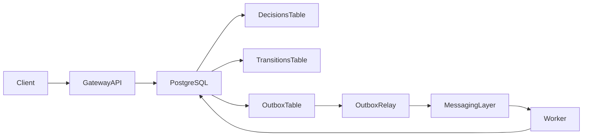
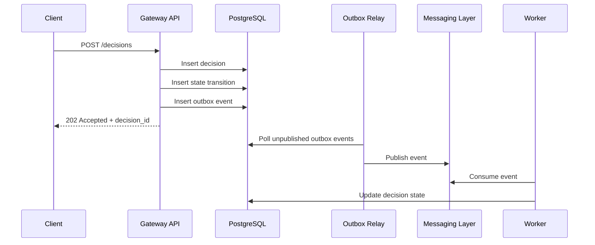

# Event-Driven Decision Processing Platform

A backend system for asynchronous decision processing built around idempotent request handling, transactional outbox, and service boundaries between synchronous API writes and background event publication.

## Architecture Overview



## Request Lifecycle



## Current Scope

- Gateway API for receiving decision requests
- PostgreSQL persistence for decisions, transitions, and outbox events
- Idempotent request handling backed by database constraints and conflict checks
- Transactional outbox pattern for atomic persistence of decisions and domain events
- Outbox relay service for publishing recorded events

## Reliability Patterns

- Idempotency enforced per caller and idempotency key
- Decision, transition, and outbox writes persisted in the same transaction
- State transitions stored explicitly for lifecycle traceability
- Event publication separated from the request path through the outbox relay

## Tech Stack

- Python
- FastAPI
- PostgreSQL
- SQLAlchemy
- Docker
- GitHub Actions

## Repository Structure

```text
services/
├── gateway-api/
├── outbox-relay/
├── worker/          # planned
infra/               # planned
loadtest/            # planned
docs/                # planned
reports/             # planned
```


## Next Steps

- Integrate a real message broker
- Add worker-based asynchronous processing
- Introduce Redis for caching and rate limiting
- Expand automated tests and local end-to-end flows
